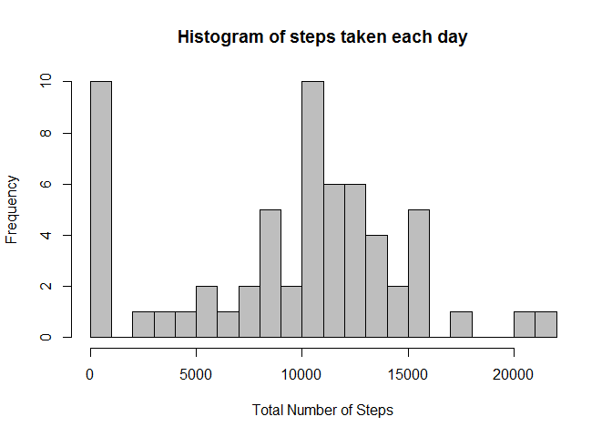
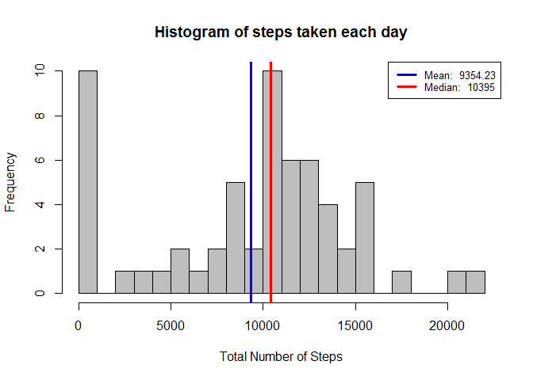
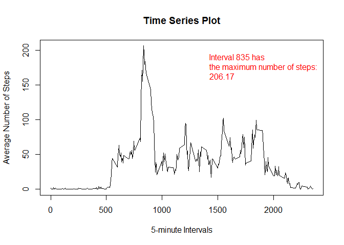
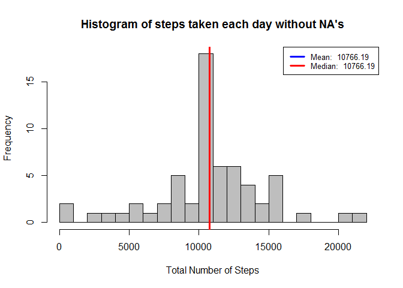

# Reproducible Research: Peer Assessment 1
Anna Popova  
7 Feb 2016 г.  


## Introduction
  
This assignment makes use of data from a personal activity monitoring device. This device collects data at 5 minute intervals through out the day. The data consists of two months of data from an anonymous individual collected during the months of October and November, 2012 and include the number of steps taken in 5 minute intervals each day.

## Data

The data for this assignment can be downloaded from the course web site.

The variables included in this dataset are:
  
* **steps**: Number of steps taking in a 5-minute interval (missing values are coded as `NA`)

* **date**: The date on which the measurement was taken in YYYY-MM-DD format

* **interval**: Identifier for the 5-minute interval in which measurement was taken

The dataset is stored in a comma-separated-value (CSV) file and there are a total of 17,568 observations in this dataset.


## Assignment

### Loading and preprocessing the data

At first, we set locale from Russian to English

```r
Sys.setlocale("LC_TIME", "English")
```

```
## [1] "English_United States.1252"
```

Then we get file with data from URL and unzip it

```r
FileUrl <- "https://d396qusza40orc.cloudfront.net/repdata%2Fdata%2Factivity.zip"

if (!file.exists("repdata-data-activity.zip")) {
  download.file(FileUrl, destfile = "repdata-data-activity.zip")
}
unzip("repdata-data-activity.zip")
```

Load the data to `activity_data`

```r
activity_data <-
  read.csv('activity.csv', header = T)
```

Transform the data into a format suitable for your analysis

```r
activity_data$date <- 
  as.Date(activity_data$date)

head(activity_data)
```

```
##   steps       date interval
## 1    NA 2012-10-01        0
## 2    NA 2012-10-01        5
## 3    NA 2012-10-01       10
## 4    NA 2012-10-01       15
## 5    NA 2012-10-01       20
## 6    NA 2012-10-01       25
```

### What is mean total number of steps taken per day?

For this part of the assignment we ignore the missing values in the dataset.

#### Make a histogram of the total number of steps taken each day

Summarize the total number of steps taken by each day

```r
StepsByDay <-
  aggregate(x = activity_data$steps,
            by = list(activity_data$date),
            FUN = sum,
            na.rm = T)
names(StepsByDay) <- c("date","steps")
```

Make histogram of steps taken each day

```r
hist(StepsByDay$steps, 
     breaks = 20,
     main = "Histogram of steps taken each day",
     xlab = 'Total Number of Steps',
     col = 'grey')
```

<!-- -->


#### Calculate and report the **mean** and **median** total number of steps taken per day
Calculate mean and median total number of steps taken per day

```r
mean_steps = round(mean(StepsByDay$steps), 2)
median_steps = round(median(StepsByDay$steps), 2)
```

draw lines for mean and median and place the legend

```r
hist(StepsByDay$steps, 
     breaks = 20,
     main = "Histogram of steps taken each day",
     xlab = 'Total Number of Steps',
     col = 'grey')

#draw lines for mean and median
abline(v = mean_steps, lwd = 3, col = 'blue')
abline(v = median_steps, lwd = 3, col = 'red')

#place legend
legend('topright',
       lty = 1,
       lwd = 3,
       col = c("blue", "red"),
       cex = .8, 
       legend = c(paste('Mean: ', mean_steps),
                  paste('Median: ', median_steps))
)
```

<!-- -->

### What is the average daily activity pattern?

To answer this question, we need the following:

1. A time series plot of the 5-minute interval (x-axis) and the average number of steps taken, averaged across all days (y-axis)
2. Find which 5-minute interval, on average across all the days in the dataset, contains the maximum number of steps

At first we summarize dataset by interval

```r
avgStepsInt <-
  aggregate(x = activity_data$steps,
            by = list(activity_data$interval),
            FUN = mean,
            na.rm = T)
names(avgStepsInt) <- c("interval", "avg_steps")
head(avgStepsInt)
```

```
##   interval avg_steps
## 1        0 1.7169811
## 2        5 0.3396226
## 3       10 0.1320755
## 4       15 0.1509434
## 5       20 0.0754717
## 6       25 2.0943396
```

Then we find interval that has the maximum average steps in 5-minute interval and plot it

```r
max_steps = avgStepsInt[which.max(avgStepsInt$avg_steps), ]
max_label = paste0("Interval ", max_steps$interval, " has \nthe maximum number of steps: \n", round(max_steps$avg_steps,2))

plot(avgStepsInt$interval, avgStepsInt$avg_steps, type="l",
     main = "Time Series Plot",
     xlab="5-minute Intervals",
     ylab="Average Number of Steps")

legend("topright",
       legend = max_label,
       text.col = 'red',
       bty = 'n'
       )
```

<!-- -->

### Imputing missing values

####Calculate and report the total number of missing values in the dataset

We should count all rows with `NA`


```r
print(paste0("There is ", sum(is.na(activity_data$steps)) , " NA's in the dataset."))
```

```
## [1] "There is 2304 NA's in the dataset."
```

####Strategy for filling in all of the missing values in the dataset

For each missing value we take the mean value for its 5-minute interval

####Create a new dataset

New dataset is equal to the original dataset but with the missing data filled in.

Create a new dataset that is equal to the original dataset

```r
fill_activity_data <- activity_data
```

Replace each missing value with the mean value of its 5-minute interval

```r
fill_activity_data$steps[which(is.na(fill_activity_data$steps))] <- tapply(fill_activity_data$steps, fill_activity_data$interval, mean, na.rm=T, simplify=F )

fill_activity_data$steps <- as.vector(fill_activity_data$steps, mode="numeric")

NewStepsByDay <-
  aggregate(x = fill_activity_data$steps,
            by = list(fill_activity_data$date),
            FUN = sum,
            na.rm = T)
names(NewStepsByDay) <- c("date","steps")

head(NewStepsByDay)
```

```
##         date    steps
## 1 2012-10-01 10766.19
## 2 2012-10-02   126.00
## 3 2012-10-03 11352.00
## 4 2012-10-04 12116.00
## 5 2012-10-05 13294.00
## 6 2012-10-06 15420.00
```

####Histogram of the total number of steps taken each day


```r
hist(NewStepsByDay$steps, 
     breaks = 20,
     main = "Histogram of steps taken each day without NA's",
     xlab = 'Total Number of Steps',
     col = 'grey')

mean_steps = round(mean(NewStepsByDay$steps), 2)
median_steps = round(median(NewStepsByDay$steps), 2)

#draw lines for mean and median
abline(v = mean_steps, lwd = 3, col = 'blue')
abline(v = median_steps, lwd = 3, col = 'red')

#place legend
legend('topright',
       lty = 1,
       lwd = 3,
       col = c("blue", "red"),
       cex = .8, 
       legend = c(paste('Mean: ', mean_steps),
                  paste('Median: ', median_steps))
)
```

<!-- -->
**Questions**:
Do these values differ from the estimates from the first part of the assignment?
What is the impact of imputing missing data on the estimates of the total daily number of steps?

**Answer To Questions**: The mean and the median are now equal after replacing missing values with the mean value for the corresponding interval. It looks like the median value would now move closer to the mean. So the Median value increased after this method of missing value replacement.

###Are there differences in activity patterns between weekdays and weekends?

For this part we will use dataset with the filled-in missing values: `fill_activity_data`

For this part the weekdays() function may be of some help here.

Creating a new factor variable in the dataset with two levels – “weekday” and “weekend” indicating whether a given date is a weekday or weekend day.


```r
weekends_days <- grepl("^[Ss]", weekdays(as.Date(fill_activity_data$date)))

for (i in (1:nrow(fill_activity_data))) {
    if (weekends_days[i] == TRUE) {
        fill_activity_data$weekdays[i] <- "weekend"
    } else {
        fill_activity_data$weekdays[i] <- "weekday"
    }
}

head(fill_activity_data)
```

```
##       steps       date interval weekdays
## 1 1.7169811 2012-10-01        0  weekday
## 2 0.3396226 2012-10-01        5  weekday
## 3 0.1320755 2012-10-01       10  weekday
## 4 0.1509434 2012-10-01       15  weekday
## 5 0.0754717 2012-10-01       20  weekday
## 6 2.0943396 2012-10-01       25  weekday
```

Make a panel plot containing a time series plot of the 5-minute interval (x-axis) and the average number of steps taken, averaged across all weekday days or weekend days (y-axis).


```r
avg_weekends_days <-
  aggregate(x = fill_activity_data$steps,
            by = list(fill_activity_data$interval, fill_activity_data$weekdays),
            FUN = mean,
            na.rm = T)
names(avg_weekends_days) <- c("interval", "day_type", "avg_steps")

head(avg_weekends_days)
```

```
##   interval day_type  avg_steps
## 1        0  weekday 2.25115304
## 2        5  weekday 0.44528302
## 3       10  weekday 0.17316562
## 4       15  weekday 0.19790356
## 5       20  weekday 0.09895178
## 6       25  weekday 1.59035639
```

```r
library(lattice)
xyplot(avg_steps~interval | day_type, data = avg_weekends_days,
      type = 'l',
      xlab = 'Interval',
      ylab = 'Number of steps',
      layout = c(1,2))
```

<!-- -->
